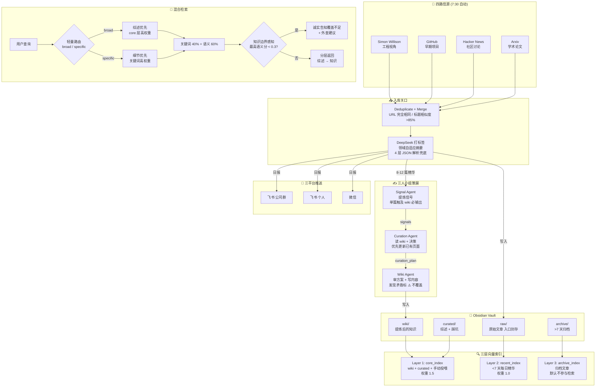

# 资料管理员 (Librarian)

个人知识库的自动化信息管理系统。四路信源 → 领域自适应摘要 → 多 Agent 策展 → 三层索引 → 检索。

每天 7:30 自动运行，30 天零中断。

## 架构总览



## 三人小组策展

项目最核心的设计。三个 Agent 协作策展，共享状态、链式依赖、全量回退。

```
Signal Agent           Curation Agent         Wiki Agent
───────────           ──────────────         ──────────
从当天 8-12 篇文章      读 wiki 相关页面         审方案合理性
提炼信号                判断更新策略            写内容或驳回
                        替代/补充/冲突/跳过      对标质量标准
       ↘               ↙
      CurationState (共享状态)
      articles → signals → curation_plan → wiki_updates
```

**失败策略：全量回退，不做逐层降级。**

任何一个 Agent 异常 → 整条策展链路穿透 → 回退到旧的确定性规则链路。理由是三个 Agent 构成推理链，一个环节出错下游全错。在知识库里写错误内容的代价远大于少写一天。

```python
# 编排入口
from multi_agent_curation.graph import run_curation_pipeline

result = run_curation_pipeline(articles, date_str="2026-06-12", dry_run=False)
# result = {
#   "signals": [...],          # Signal Agent 提炼的信号
#   "curation_plan": [...],    # Curation Agent 的决策方案
#   "wiki_updates": [...],     # Wiki Agent 的审核 + 写入结果
# }
```

## 检索架构

```
用户查询
  → 轻量路由 (LLM 一句话分类: broad/specific)
  → 混合检索 (关键词 40% + 语义 60%)
  → 三层权重 (core 1.5 / recent 1.0 / archive 0.0)
  → 分层返回 (综述 → 知识，raw 不参与)
  → 知识边界感知 (最高语义分 < 0.3 → 诚实说不知道)
```

## 快速开始

```bash
# 1. 配置凭证
echo "DEEPSEEK_API_KEY=sk-xxx" > .env

# 2. 手动跑一次完整管线
python agent.py

# 3. 手动投喂
python agent.py --manual --url "https://..."

# 4. 触发三人小组策展
python -c "from multi_agent_curation.graph import run_curation_pipeline; ..."

# 5. 检索
bash search_obsidian.sh "agent memory"

# 6. 增量索引
python indexer.py --incremental
```

## 精选设计决策

39 条设计决策中，最具面试价值的 5 条：

| # | 决策 | 为什么 |
|---|------|--------|
| 1 | **全量回退而非逐层降级** | 三个 Agent 是推理链不是并行任务。一个挂 → 下游全偏。知识库里写错的代价 > 少写一天 |
| 2 | **四路信源差异化** | Simon 工程视角 / GitHub 早期项目 / HN 社区讨论 / Arxiv 论文。各搜不同 query，互补不重叠 |
| 3 | **raw 不参与检索** | raw 的价值已被提炼到 wiki。搜索结果只返回综述 + wiki，从源头防止信息过载 |
| 4 | **从信息管道转向注意力引擎** | 问题不是信息不够多，是太多。核心定位从"管理资料"改为"管理注意力" |
| 5 | **新字段追加到末尾不破坏序号** | `tech_summary`/`trend_signal`/`relevance_to_me` 三字段替代单一 `one_liner`。新字段在 awk 输出的 $15-$17，$1-$14 不变，全链路兼容 |

完整列表见 [CLAUDE.md](./CLAUDE.md)。

## 运行统计

```
过去 30 天:
  抓取文章:     ~750 篇
  入库精华:     ~180 篇（筛选率 76%）
  三人小组策展:   ~12 次
  wiki 更新:     ~8 篇
  推送通知:      ~90 条
  管线失败率:    0%（fallback 链路兜底）
```

## 技术栈

`Python` `DeepSeek` `Obsidian` `ChromaDB` `Sentence Transformers` `Bash` `Windows Task Scheduler`

## 目录

```
librarian/
├── agent.py                  主编排器（cron 入口）
├── models.py                 Article + ArticleStore 统一数据模型
├── config.py                 统一配置（.env + config.yaml 单点加载）
├── fetch_sources.py          四路抓取 + 去重 + retry + pending
├── tagger.py                 DeepSeek 打标签（4 层 JSON 解析兜底）
├── multi_agent_curation/     三人小组策展
│   ├── state.py              CurationState 共享状态
│   ├── agents.py             Signal / Curation / Wiki Agent
│   ├── graph.py              编排入口 run_curation_pipeline()
│   └── tools.py              read_wiki / search_wiki / write_wiki
├── searcher.py               统一检索入口（含轻量路由）
├── indexer.py                三层向量索引（mtime 原子化）
├── processor.py              标签统计 + 异常检测 + 关联笔记
├── contradiction.py          碰撞检测（新文章 vs wiki/综述）
├── notifier.py               飞书 ×2 + 微信 统一推送
├── archiver.py               >7 天文章归档
├── config.yaml               集中配置（路径/权重/阈值）
└── README.md
```
